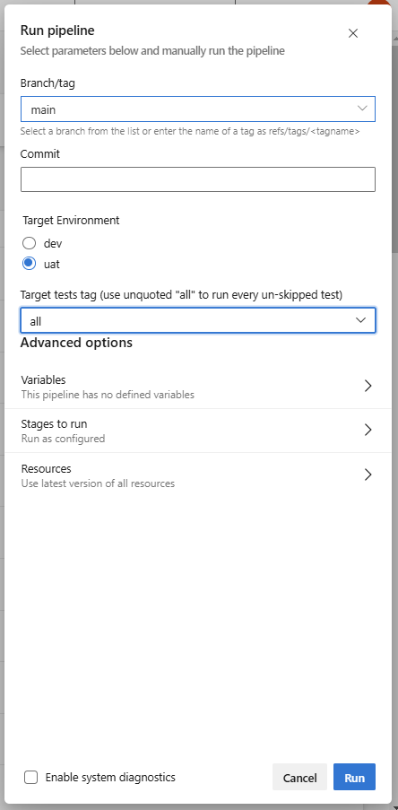
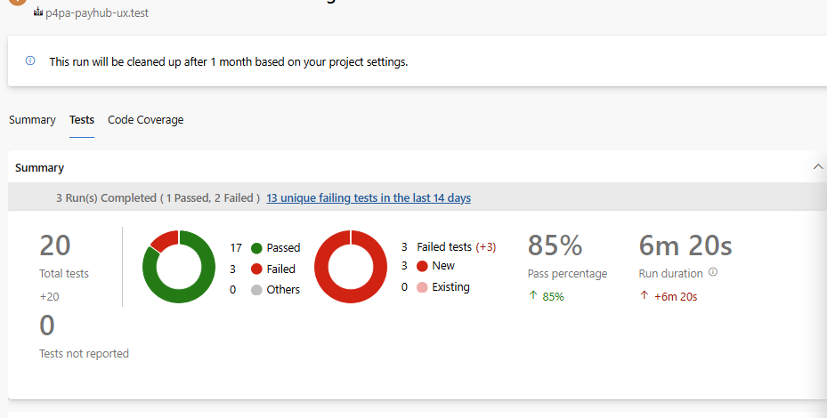
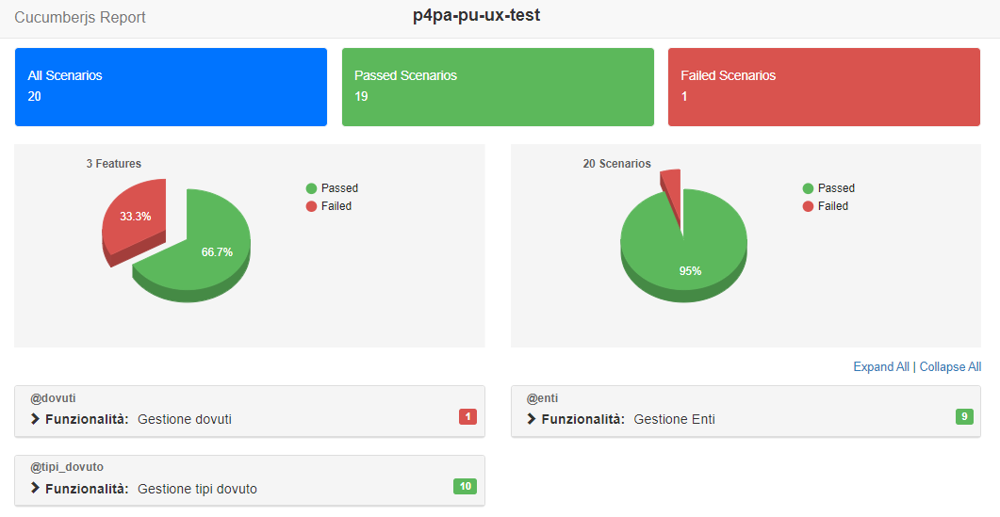

# UX testing
A repository designed to gather tests that simulate the user experience on the Piattaforma Unitaria portal.

## Installation

- Cucumber js: ```npm install --save-dev @cucumber/cucumber```
- Playwright: ```npm init playwright@latest```
- Report: ```npm install cucumber-junit-convert --save-dev``` & ```npm install cucumber-html-reporter --save-dev```

## Project structure

- ```features```: contains all scenarios related to the functionality of the portal
- ```features\step```: contains all the steps that define the scenario
- ```setup```: contains file with *hooks*, that are used for setup and teardown of the environment before and after each scenario
- ```config```: contains secrets file template and config to retrieve all secrets variables from env
- ```report```: contains the converters to get test results in xml or html and also the package where screenshots are created in case of test failure

## Execute tests on DevOps
To run tests on Azure DevOps, proceed as follows:
1. Go to `p4pa-payhub-ux.test` [pipeline](https://dev.azure.com/pagopaspa/p4pa-projects/_build?definitionId=1777)
2. Click on **Run pipeline**
3. Select the environment to test on (DEV or UAT) and choose from the drop-down menu the group of tests to run based on the tag (_Target tests tag_) </br> 
4. Click on **Run**
5. Tests are executed in the pipeline step “Execute tests”, where you can read the steps of each scenario tested
6. Finally, the result of tests are published in section "Tests" (as in the following image) with the attachment in case of failure (like screenshot in base64) </br> 

## Execute tests locally

To run tests locally, proceed as follows:
1. Create _`.env`_ file in the main folder with two variables:
	```text
	PU_SECRET_PATH="config/pu_ux_secrets.yaml"
	PU_TARGET_ENV="dev"    //or "uat"
	```
	The _secret_path_ variable is used to indicate the path where the secret variables will be set.</br>
	The _target_env_ is used to set the environment in which tests are runned.
2. Set the secret variables in a yaml file in folder `config` as said in step before in _`.env`_ file.
   The structure of this file should be as it is specified in the template _`pu_ux_secrets_template.yaml`_
   (Variables in both environments are to be set in consecutive blocks).

3. In _`package.json`_ file is defined a script that runs the tests and at the end creates an html report.</br> So, just need to run the command: 
	```bash
	$ npm run tests:local
	```
 	The html report that opens automatically in the browser is like this: </br>  
4. In _`hooks.cjs`_ are specified of ways in which the tests are runned, such as `headless` mode or `slowMo`. If you want to test a scenario by seeing actions directly with the browser open then it should be set `headless: false`.
5. The test scenarios are divided by feature, and each has a related ***tag*** specified with @ at the beginning. So, if you want to test a certain feature or a single scenario you have to add it in the script, like: 
	```json
	"tests:local": "cucumber-js --tags=\"@<mytag>\" -f json:report/report.json & node ./report/htmlconverter.js"
	```
6. As said before, the script at the end creates a report html where you can see the tests performed and any errors and screenshots (these are also visible in the folder `report/screenshots`).

